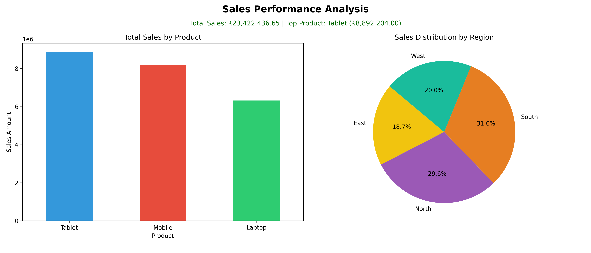

# sales-project
Sales Project – First Internship Project at Agneyra

##  Internship Project Overview
This project was developed as part of my **Data Analytics Internship at Agneyara**.  
The objective of this project is to analyze sales data, handle missing values, remove duplicates, and generate meaningful business insights using visual dashboards.

## 🎯 Project Objectives
- Load and analyze sales data from Excel
- Handle missing values and duplicate records
- Calculate total sales and top-selling products
- Analyze sales distribution by product and region
- Create a visual sales dashboard

##  Company
**Agneyra**  
(Data Analytics Internship Project)

##  Technologies Used
- Python
- Pandas
- Matplotlib
- Excel (XLSX file handling)

## 📂 Project Structure

##  Data Processing Steps
- Checked dataset structure and column details
- Identified missing values
- Filled missing `Quantity` and `Sales` values using mean
- Detected and removed duplicate records
- Performed group-by analysis on Product and Region

## 📊 Analysis & Insights
- **Total Sales** calculated from dataset
- **Top-Selling Product** identified based on sales value
- **Product-wise Sales Analysis** using bar chart
- **Region-wise Sales Distribution** using pie chart

##  How to Run the Project
1. Clone the repository  
git clone https://github.com/Trupti-patil12/sales-project.git
2. Navigate to project folder  
3. Run the Python script  

## 📸 Dashboard Output

## Learning Outcomes
- Practical experience with real-world sales data
- Hands-on data cleaning and preprocessing
- Data visualization using Matplotlib
- Understanding business insights through analytics

##  Author
**Trupti Patil**  
Data Analytics Intern – Agneyra

🏢 Internship Details
Company: Agneyra
Project Type: Mini Project
Project Number: first project Project
Email: agneyra63@gmail.com
URN: UDYAM-AP-01-011115

